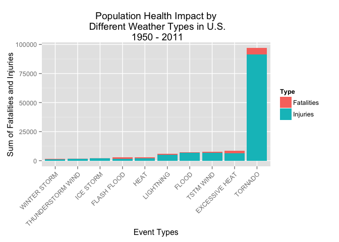
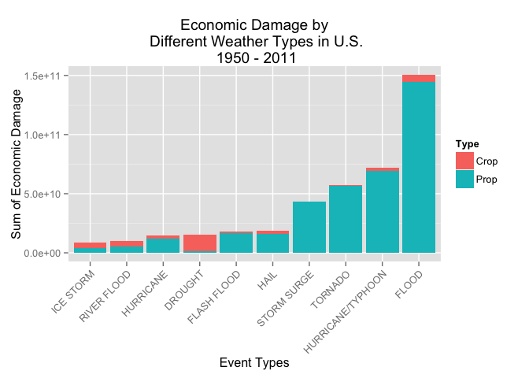

# Public Health and Economic Damage Analysis based on Different Weather Event Type From 1950 to 2011 in U.S.
Liang Dong  
20 September 2014  
# Synopsis

In this report, the storm data recored by National Weather Service from 1950 to 2011 in U.S.  will be analyzed to determined which weather event type is most harmful to pulic health, and which weather event type did most damage to economics especially on crops and property. In the analysis, the result has been found that **Tornado** did most damage to public health, and **Flood** did most damage on economics.

# Data Processing

First load the packages for chunks running in this document.


```r
# set global chunk options
library(knitr)
library(R.utils)
```

```
## Loading required package: R.oo
## Loading required package: R.methodsS3
## R.methodsS3 v1.6.1 (2014-01-04) successfully loaded. See ?R.methodsS3 for help.
## R.oo v1.18.0 (2014-02-22) successfully loaded. See ?R.oo for help.
## 
## Attaching package: 'R.oo'
## 
## The following objects are masked from 'package:methods':
## 
##     getClasses, getMethods
## 
## The following objects are masked from 'package:base':
## 
##     attach, detach, gc, load, save
## 
## R.utils v1.33.0 (2014-08-24) successfully loaded. See ?R.utils for help.
## 
## Attaching package: 'R.utils'
## 
## The following object is masked from 'package:utils':
## 
##     timestamp
## 
## The following objects are masked from 'package:base':
## 
##     cat, commandArgs, getOption, inherits, isOpen, parse, warnings
```

```r
library(ggplot2)
```

## Download the Raw Data

First download and unzip file from [Storm Data](https://d396qusza40orc.cloudfront.net/repdata%2Fdata%2FStormData.csv.bz2). If the data is already exist, then load the csv directly.


```r
if (!file.exists("storm_data.csv")) {
    fileURL <- "https://d396qusza40orc.cloudfront.net/repdata%2Fdata%2FStormData.csv.bz2"
    download.file(fileURL, destfile="storm_data.csv.bz2", method="curl")
    bunzip2("storm_data.csv.bz2")    
}

storm_data <- read.csv("storm_data.csv")
```

## Overview of the Raw Data

To have a initial view of the data, the head of the storm database will be listed here:


```r
head(storm_data)
```

```
##   STATE__           BGN_DATE BGN_TIME TIME_ZONE COUNTY COUNTYNAME STATE
## 1       1  4/18/1950 0:00:00     0130       CST     97     MOBILE    AL
## 2       1  4/18/1950 0:00:00     0145       CST      3    BALDWIN    AL
## 3       1  2/20/1951 0:00:00     1600       CST     57    FAYETTE    AL
## 4       1   6/8/1951 0:00:00     0900       CST     89    MADISON    AL
## 5       1 11/15/1951 0:00:00     1500       CST     43    CULLMAN    AL
## 6       1 11/15/1951 0:00:00     2000       CST     77 LAUDERDALE    AL
##    EVTYPE BGN_RANGE BGN_AZI BGN_LOCATI END_DATE END_TIME COUNTY_END
## 1 TORNADO         0                                               0
## 2 TORNADO         0                                               0
## 3 TORNADO         0                                               0
## 4 TORNADO         0                                               0
## 5 TORNADO         0                                               0
## 6 TORNADO         0                                               0
##   COUNTYENDN END_RANGE END_AZI END_LOCATI LENGTH WIDTH F MAG FATALITIES
## 1         NA         0                      14.0   100 3   0          0
## 2         NA         0                       2.0   150 2   0          0
## 3         NA         0                       0.1   123 2   0          0
## 4         NA         0                       0.0   100 2   0          0
## 5         NA         0                       0.0   150 2   0          0
## 6         NA         0                       1.5   177 2   0          0
##   INJURIES PROPDMG PROPDMGEXP CROPDMG CROPDMGEXP WFO STATEOFFIC ZONENAMES
## 1       15    25.0          K       0                                    
## 2        0     2.5          K       0                                    
## 3        2    25.0          K       0                                    
## 4        2     2.5          K       0                                    
## 5        2     2.5          K       0                                    
## 6        6     2.5          K       0                                    
##   LATITUDE LONGITUDE LATITUDE_E LONGITUDE_ REMARKS REFNUM
## 1     3040      8812       3051       8806              1
## 2     3042      8755          0          0              2
## 3     3340      8742          0          0              3
## 4     3458      8626          0          0              4
## 5     3412      8642          0          0              5
## 6     3450      8748          0          0              6
```

## Pre-processing the Data

In this report, two question are addressed. The first question addressed on public population health, which is related to the column "FATALITIES" and "INJURIES", while the second question addressed on economic consequences, which is related to column "PROPDMG", "PROPDMGEXP", "CROPDMG" and "CROPDMGEXP". So two different data will be prepared in this section for two different questions.

### Pre-processing the Data for Public Health

To pre-process the data for public health impact, first three useful columns "EVTYPE", "FATALITIES" and "INJURIES" should be subtracted from the raw data. Then calculate the sum for each weather event type. Because there are too many event types, only the 10 weather event type which did most damage to public health will be showing in the processed data. Finally the processed data will be converted into the bar plot ready data frame for plotting. The final bar diagram will be shown in the result section.


```r
# Subset health related column and event column from raw data
storm_data_health<-storm_data[,c("EVTYPE", "FATALITIES", "INJURIES")]

# Calculate the sum of the fatalities and injuries for each event types
health_result <- data.frame(tapply(storm_data_health$FATALITIES, storm_data_health$EVTYPE, sum))
injuries <- data.frame(tapply(storm_data_health$INJURIES, storm_data_health$EVTYPE, sum), row.names = NULL)

# Construct a new data frame for sum of each event types
colnames(health_result) <- "Fatalities"
colnames(injuries) <- "Injuries"
health_result$Injuries <- injuries$Injuries
health_result$Event <- row.names(health_result)
row.names(health_result) <- NULL

# Add a Sum Column to the new data frame
health_result$Sum <- health_result$Fatalities+health_result$Injuries

# Subset the top 10 event type on Sum
top_10 <- head(health_result[order(-health_result$Sum),],10)
row.names(top_10) <- NULL

# Convert top 10 data frame into bar chart ready data frame

health_bar <- top_10[, c("Event", "Injuries")] 
colnames(health_bar) <- c("Event", "Number") 
health_bar$Type <- rep("Injuries", 10)
temp <- top_10[, c("Event", "Fatalities")]
colnames(temp) <- c("Event", "Number") 
temp$Type <- rep("Fatalities", 10)
health_bar <- rbind(health_bar, temp)
```

After processing, the top 10 event types summary are listed here:


```r
kable(top_10, align = "c")
```


| Fatalities | Injuries |       Event       |  Sum  |
|:----------:|:--------:|:-----------------:|:-----:|
|    5633    |  91346   |      TORNADO      | 96979 |
|    1903    |   6525   |  EXCESSIVE HEAT   | 8428  |
|    504     |   6957   |     TSTM WIND     | 7461  |
|    470     |   6789   |       FLOOD       | 7259  |
|    816     |   5230   |     LIGHTNING     | 6046  |
|    937     |   2100   |       HEAT        | 3037  |
|    978     |   1777   |    FLASH FLOOD    | 2755  |
|     89     |   1975   |     ICE STORM     | 2064  |
|    133     |   1488   | THUNDERSTORM WIND | 1621  |
|    206     |   1321   |   WINTER STORM    | 1527  |

### Pre-processing the Data for Economic Consequences

To pre-processing the data, it is essential to set the unit of "CROPDMGEXP" and "PROPDMGEXP" to the same level first.

According to the current level of "CROPDMGEXP" and "PROPDMGEXP", there are multiple levels of unit, which are:


```r
levels(storm_data$CROPDMGEXP)
```

```
## [1] ""  "?" "0" "2" "B" "k" "K" "m" "M"
```

```r
levels(storm_data$PROPDMGEXP)
```

```
##  [1] ""  "-" "?" "+" "0" "1" "2" "3" "4" "5" "6" "7" "8" "B" "h" "H" "K"
## [18] "m" "M"
```

In this analysis, the "-", "?", "+" in unit of Property Damage and Crop Damage will be consider invalid levels. So those levels will be replaced by 0 from the storm database.


```r
# Substract the useful column from raw data
economic <- storm_data[, c("EVTYPE", "PROPDMG", "PROPDMGEXP", "CROPDMG", "CROPDMGEXP")]

# Replace the invalid character in exp column
economic$PROPDMGEXP[economic$PROPDMGEXP %in% c("?", "", "-", "+")] <- 0
economic$CROPDMGEXP[economic$CROPDMGEXP %in% c("?", "", "-", "+")] <- 0
```

Then the "CROPDMGEXP" and "PROPDMGEXP" will be unified to numbers, by replacing the B, h, H, k, K, m and M to corresponding numbers. 


```r
# Unified the exp column to the same level
levels(economic$PROPDMGEXP) <- c(levels(economic$PROPDMGEXP), 9)
levels(economic$CROPDMGEXP) <- c(levels(economic$CROPDMGEXP), rep(0:9))

economic$PROPDMGEXP[economic$PROPDMGEXP == "B"] <- 9
economic$PROPDMGEXP[economic$PROPDMGEXP == "h"] <- 2
economic$PROPDMGEXP[economic$PROPDMGEXP == "H"] <- 2
economic$PROPDMGEXP[economic$PROPDMGEXP == "K"] <- 3
economic$PROPDMGEXP[economic$PROPDMGEXP == "m"] <- 6
economic$PROPDMGEXP[economic$PROPDMGEXP == "M"] <- 6

economic$CROPDMGEXP[economic$CROPDMGEXP == "B"] <- 9
economic$CROPDMGEXP[economic$CROPDMGEXP == "k"] <- 3
economic$CROPDMGEXP[economic$CROPDMGEXP == "K"] <- 3
economic$CROPDMGEXP[economic$CROPDMGEXP == "m"] <- 6
economic$CROPDMGEXP[economic$CROPDMGEXP == "M"] <- 6
```

Then calculate the sum of the property damage, crop damage and total damage base on weather event types, and ordered from top to bottom and get 10 most economic damage weather types. Finally convert the data frame into the bar chart plot ready data frame for plotting.


```r
# Calculate the sum of corp damage and property damage
economic$CropSum <- economic$CROPDMG * 10^as.numeric(as.character(economic$CROPDMGEXP))
economic$PropSum <- economic$PROPDMG * 10^as.numeric(as.character(economic$PROPDMGEXP))

# Calculate the total sum of economic damage
economic$Sum <- economic$CropSum + economic$PropSum

# Get top 10 damage of each event type
economic <- economic[, c("EVTYPE", "CropSum", "PropSum", "Sum")]
economic <- cbind(data.frame(tapply(economic$Sum, economic$EVTYPE, sum)), 
              data.frame(tapply(economic$CropSum, economic$EVTYPE, sum)),
              data.frame(tapply(economic$PropSum, economic$EVTYPE, sum)))
colnames(economic) <- c("Sum", "CropSum", "PropSum")
economic_top10 <- head(economic[order(-economic$Sum),],10)

# Apply economic_top10 into bar chart ready data frame

economic_top10$Type <- row.names(economic_top10)
row.names(economic_top10) <- NULL

economic_bar <- economic_top10[, c("Type", "PropSum")] 
colnames(economic_bar) <- c("Event", "Damage") 
economic_bar$Type <- rep("Prop", 10)
temp <- economic_top10[, c("Type", "CropSum")]
colnames(temp) <- c("Event", "Damage") 
temp$Type <- rep("Crop", 10)
economic_bar <- rbind(economic_bar, temp)
```

The top 10 weather event which did most economic damage did are:


```r
kable(economic_top10, align = "c")
```


|    Sum    |  CropSum  |  PropSum  |       Type        |
|:---------:|:---------:|:---------:|:-----------------:|
| 1.503e+11 | 5.662e+09 | 1.447e+11 |       FLOOD       |
| 7.191e+10 | 2.608e+09 | 6.931e+10 | HURRICANE/TYPHOON |
| 5.736e+10 | 4.150e+08 | 5.695e+10 |      TORNADO      |
| 4.332e+10 | 5.000e+03 | 4.332e+10 |    STORM SURGE    |
| 1.876e+10 | 3.026e+09 | 1.574e+10 |       HAIL        |
| 1.824e+10 | 1.421e+09 | 1.682e+10 |    FLASH FLOOD    |
| 1.502e+10 | 1.397e+10 | 1.046e+09 |      DROUGHT      |
| 1.461e+10 | 2.742e+09 | 1.187e+10 |     HURRICANE     |
| 1.015e+10 | 5.029e+09 | 5.119e+09 |    RIVER FLOOD    |
| 8.967e+09 | 5.022e+09 | 3.945e+09 |     ICE STORM     |

# Results

## The Result for Health Impact for each Event

The below bar chart shows the weather event type **Tornado** has the biggest impact on public health because it cause 96979 deaths and injuries. Other event types are much lower than Tornado. The second to tenth weather event are Excessive Heat, Tstm Wind, Flood, Lightning, Heat, Flash Flood, Ice Storm, Thunderstorm Wind, Winter Storm, which the impact numbers are from 8428 to 1527.


```r
ggplot(health_bar, aes(reorder(Event, Number), Number, fill=Type)) + geom_bar(stat="identity") + theme(axis.text.x = element_text(angle = 45, hjust = 1)) + xlab("Event Types") + ylab("Sum of Fatalities and Injuries") + ggtitle("Top Public Health Impact by\n Different Weather Types in U.S.\n 1950 - 2011")
```

 

## The Result for Economic Damage for each Event

From the below bar plot, we can see the **Flood** event type has largest damage to the economic. Most of its damage are Prop damage. The second to tenth place are Hurrican/Typhoon, Tornado, Storm Surge, Hail, Flash Flood, Drought, Hurrican, River Flood, Ice Storm. Most of their damage are property damage except Drought, River Flood and Ice Storm, which they did damage mainly to crop.


```r
ggplot(economic_bar, aes(reorder(Event, Damage), Damage, fill=Type)) + geom_bar(stat="identity") + theme(axis.text.x = element_text(angle = 45, hjust = 1)) + xlab("Event Types") + ylab("Sum of Economic Damage") + ggtitle("Economic Damage by\n Different Weather Types in U.S.\n 1950 - 2011")
```

 

# Conclusion

The **Tornado** is most harmful with respect to population health, while the **Flood** did most economic damage.

